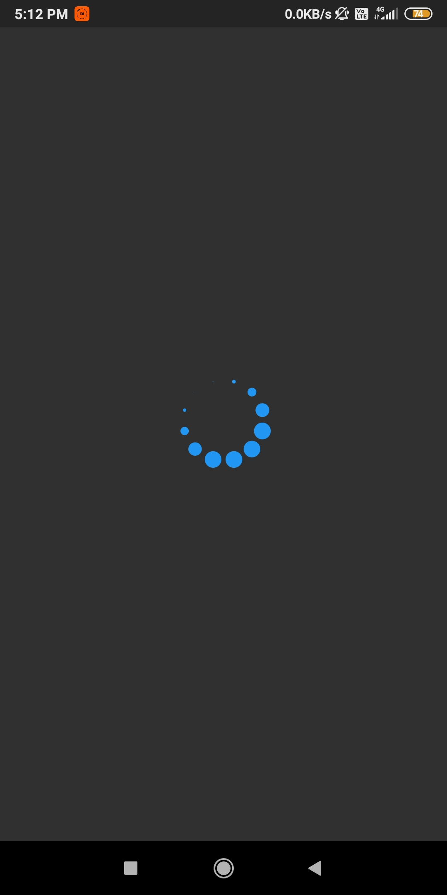
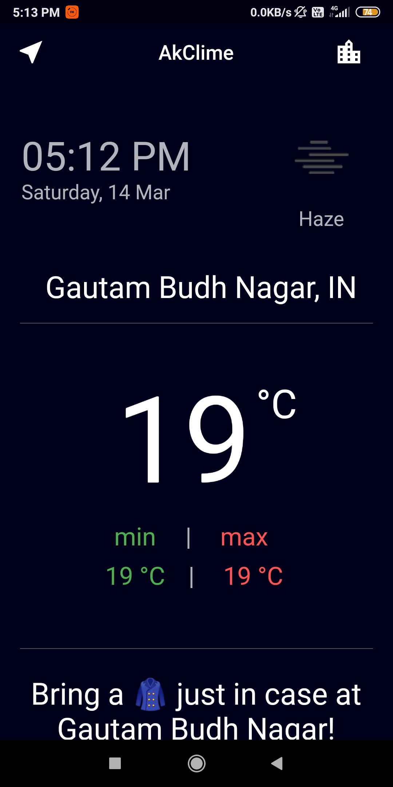
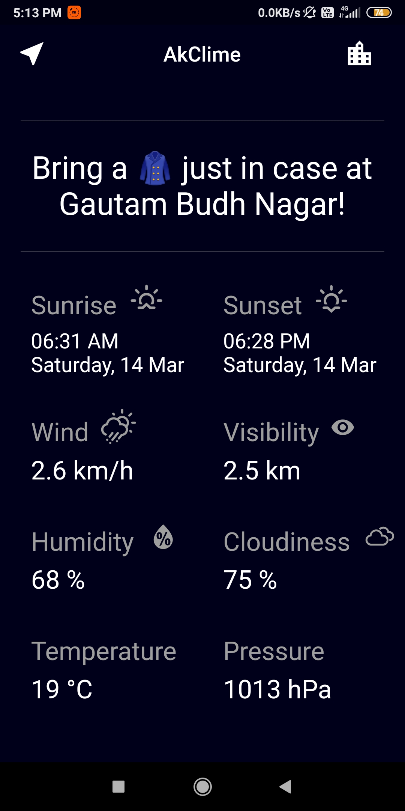
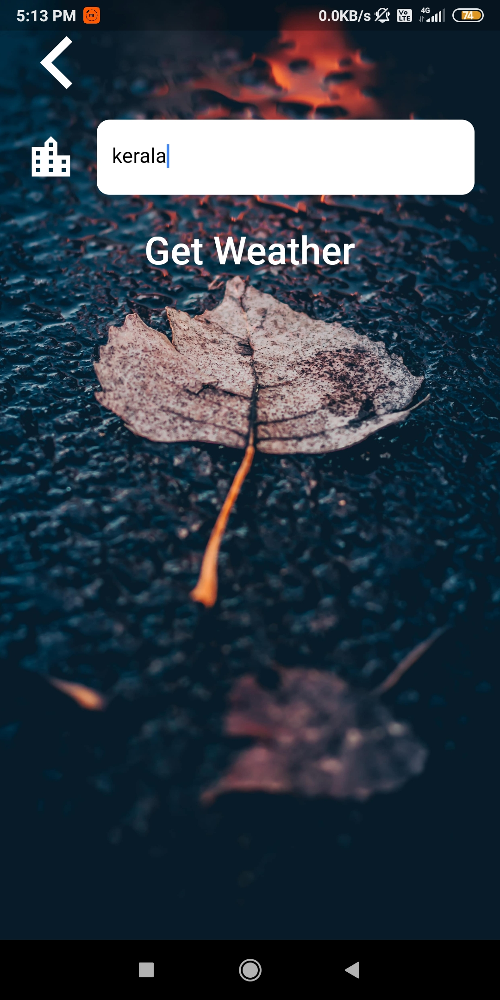
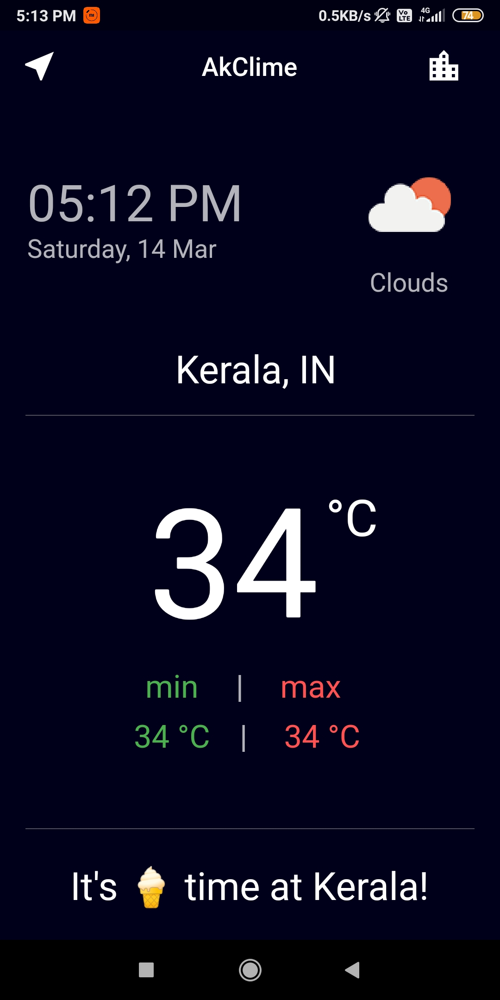

# AkClima
a weather forecast app in flutter.
 

#    Embedded Features 
 1. Working with REST API(Open Weather Map) 
 2. Position (get current GPS Location)
 
 
 # Widgets Used Never Before 
- Position 
- Location 
- Spinner 

# UI and Functionalities 

<h2> IMAGES </h2>

 
 
 
 
 
 

